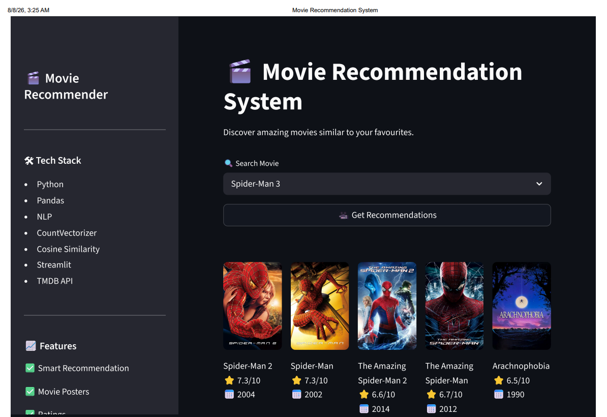

# 🎬 Movie Recommendation System

A content-based Movie Recommendation System built using **Python**, **Streamlit**, **Machine Learning**, **NLP**, and the **TMDB API**. The application recommends movies similar to the one selected by the user and displays their posters with ratings.

## 🚀 Features

* 🎥 Recommend similar movies instantly
* 🖼️ Display movie posters using TMDB API
* ⭐ Show movie ratings
* 🔍 Search movies from the dataset
* ⚡ Fast recommendations using Cosine Similarity
* 🎨 Clean and responsive Streamlit interface

## 🛠️ Tech Stack

* Python
* Streamlit
* Pandas
* NumPy
* Scikit-learn
* NLP (CountVectorizer)
* Cosine Similarity
* TMDB API
* HTML & CSS

## 📂 Project Structure

```text
MRS/
│── app.py
│── poster.py
│── movies.pkl
│── requirements.txt
│── style.css
│── tmdb_5000_movies.csv
│── tmdb_5000_credits.csv
│── mrs.ipynb
│── .gitignore
```

## ⚙️ Installation

Clone the repository:

```bash
git clone https://github.com/Mohid223/MRS.git
cd MRS
```

Install dependencies:

```bash
pip install -r requirements.txt
```

Create a `.env` file:

```env
TMDB_API_KEY=YOUR_API_KEY
```

Run the application:

```bash
streamlit run app.py
```

## 🧠 Machine Learning Workflow

* Data Cleaning
* Feature Engineering
* Text Vectorization using CountVectorizer
* Cosine Similarity Calculation
* Recommendation Engine
* Poster & Rating Fetching using TMDB API
* Streamlit Deployment

## 📸 Screenshots

<p align="center">
  
</p>

### Home Page


## 👨‍💻 Author

**Mohiuddin**

GitHub: https://github.com/Mohid223

---

 
